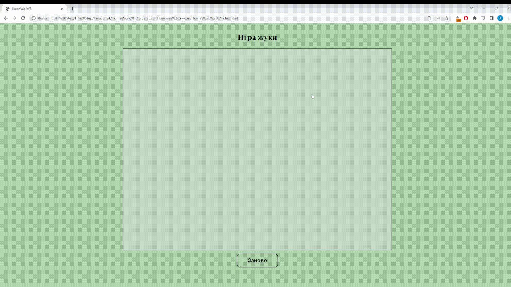
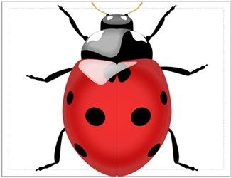

# Игра Жуки "Catch the Bugs" 

### Инструкция
 1. Нажиаем на кнопку "Заново" <br>
 2. Ловим жуков 
 ---
 

### Демонстрация

---


***HTML***
```html
<!DOCTYPE html>
<html lang="ru">
<head>
    <meta charset="UTF-8">
    <meta name="viewport" content="width=device-width, initial-scale=1.0">
    <title>HomeWork#8</title>
    <link rel="stylesheet" href="styles/main.css">
</head>
<body>
    <h2>Игра жуки</h2>
    <div id="box"> </div>
    <div id="btn-refresh">Заново</div>
    <script src="scripts/main.js"></script>
</body>
</html>
```
***CSS***
```html
body {
    display: flex;
    flex-direction: column;
    justify-content: center;
    align-items: center;
    background-color: rgba(0, 100, 0, 0.342);
}

#box {
    border: 2px solid black;
    width: 800px;
    height: 600px;
    display: inline-block;
    justify-content: center;
    background-color: rgba(222, 229, 230, 0.425);
    align-items: center;
}

img {
    position: relative;
    width: 35px;
    height: 35px;
    border-radius: 50%;
    user-select: none;
    cursor: pointer;
    transition: background-color .3s;
}
#btn-refresh {
    border: 2px solid black;
    padding: 10px;
    margin-top: 10px;
    display: inline-block;
    align-items: center;
    justify-content: center;
    user-select: none;
    cursor: pointer;
    transition: background-color .3s;
    border-radius: 10px;
    width: 100px;
    text-align: center;
    font-family: Arial, Helvetica, sans-serif;
    font-size: 16px;
    font-weight: bold;
}
#btn-refresh:hover {
    font-size: 20px;
    background-color: rgba(128, 255, 0, 0.336);
}
#winer {
    justify-content: center;
}
```


***Java Script***
```html
var countBugs;
document.getElementById('btn-refresh').addEventListener('click', () => {
    countBugs = 5;
    setInterval(() => {
        document.getElementById('box').innerHTML = '';
        for (let i = 0; i < +countBugs; i++) {
            let X = getRandomCoordinate(0, 300);
            let Y = getRandomCoordinate(0, 550);
            box.innerHTML += (
                ` <div "  style="display: inline-block;">
                   </div> `
            )
        }
    }, 1000);
});

//функция рандома координат
function getRandomCoordinate(min, max) {
    return Math.floor(Math.random() * (max - min)) + min;
}
document.getElementById('box').addEventListener('click', e => {
    if (e.target.className == 'bug') {

        let id = e.target.id;
        document.getElementById(`${id}`).style.display = 'none';
        countBugs = +countBugs - 1;
        console.log(`${countBugs}`)
        if (countBugs == 0) {
            setTimeout(() => { alert('Вы победили') }, 100);
        }
    }
});
```


